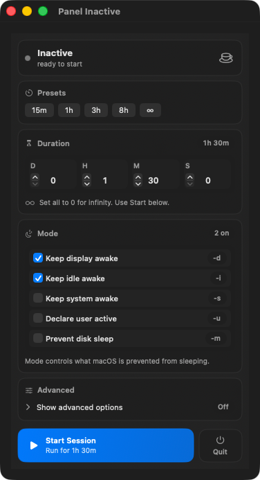
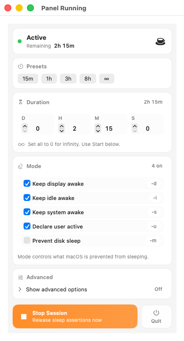
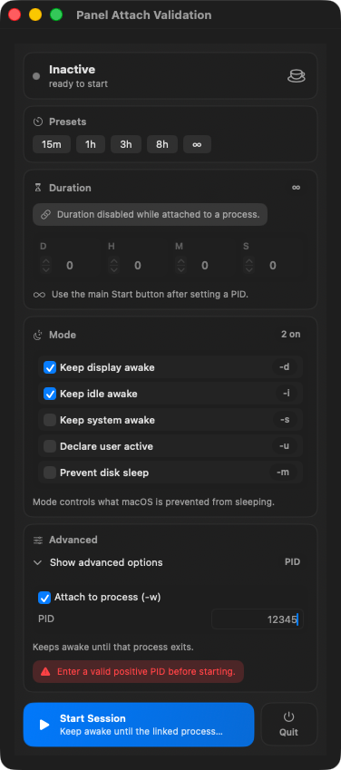

# CaffBar

CaffBar is a polished macOS menu bar utility that controls `/usr/bin/caffeinate` with one-click presets, custom duration components, and a small set of clear sleep-prevention mode toggles.

It runs as a menu bar agent (no Dock icon) and keeps the UI focused on the common workflows:
- quick presets (`15m`, `1h`, `3h`, `8h`, infinity)
- custom duration using day/hour/minute/second components
- core `caffeinate` mode flags (`-d`, `-i`, `-s`, `-u`)
- optional advanced controls (`-m`, attach to PID via `-w`)

## UX Overview

- Menu bar icon stays fixed in width and switches between idle and active cup states
- Remaining time is shown inside the menu panel and in the status item's hover text, including `∞` for indefinite runs
- Presets start immediately without changing the primary `Start Session` action
- The primary `Start Session` action always uses the current duration components (`0 = infinity`)
- Advanced options are collapsed by default to keep the main menu uncluttered

## Build and Run (Xcode)

### Open in Xcode

```bash
cd caffbar
open CaffBar.xcodeproj
```

### Run from command line

```bash
cd caffbar
xcodebuild -project CaffBar.xcodeproj -scheme CaffBar -configuration Debug build
```

Minimum target is macOS 14.0.

## Local Git Hooks (Recommended)

This repo uses native Git hooks (not Husky) to validate the Xcode project locally before each commit.

### One-time setup

```bash
cd caffbar
./scripts/setup-git-hooks.sh
```

This configures:
- `core.hooksPath = .githooks`
- a `pre-commit` hook that runs `./scripts/validate-local.sh`

### What gets validated on commit

- Docs-only commits (`README`, `docs/`, `LICENSE`, `.gitignore`) skip build validation
- Tooling/workflow changes (`scripts/`, `.githooks/`, `.github/workflows/`) run **fast** checks:
  - `Info.plist` / `project.pbxproj` syntax
  - workspace/scheme XML syntax (if `xmllint` is installed)
  - shell script syntax (`bash -n`)
  - release workflow YAML parse (`ruby`)
- Swift/Xcode project changes (`CaffBar/`, `CaffBar.xcodeproj/`) run **full** validation:
  - fast checks above
  - `xcodebuild -list`
  - Debug build for macOS destination

### Skip once (emergency only)

```bash
CAFFBAR_SKIP_HOOKS=1 git commit -m "your message"
```

### Run validation manually

```bash
./scripts/validate-local.sh --fast
./scripts/validate-local.sh --full
```

## Packaging

`MARKETING_VERSION` in `CaffBar.xcodeproj/project.pbxproj` is the version source of truth.

```bash
cd caffbar
./scripts/package.sh
```

This produces:
- `dist/CaffBar-<version>.zip`
- `dist/CaffBar-<version>.dmg`

The script prints SHA-256 hashes for both artifacts.

## Homebrew Install

Homebrew continues to use the ZIP release artifact.

Tap repo: `akalp/homebrew-caffbar`

```bash
brew install --cask akalp/caffbar/caffbar
```

Alternative:

```bash
brew tap akalp/caffbar
brew install --cask caffbar
```

## Direct Download

GitHub releases publish both a ZIP and a DMG.

For a manual install using the DMG:
1. Open `CaffBar-<version>.dmg`
2. In the `Install CaffBar` window, drag `CaffBar.app` into `Applications`
3. Launch CaffBar from `Applications`

## Troubleshooting

### Gatekeeper warns that the app is from an unidentified developer

Unsigned builds and DMGs are expected by default. If macOS blocks a manual install, try right-clicking the app and choosing `Open`, or remove quarantine:

```bash
xattr -dr com.apple.quarantine /Applications/CaffBar.app
```

### `caffeinate` fails to start

- Confirm `/usr/bin/caffeinate` exists (standard on macOS)
- Stop an existing CaffBar session and try again
- If using `Attach to process (-w)`, verify the PID is a positive integer

## Screenshots

These screenshots are generated from the SwiftUI preview states in `CaffBar/PreviewSupport/MenuPanelPreviews.swift`.

### Inactive Panel



### Active Session



### Advanced Controls


